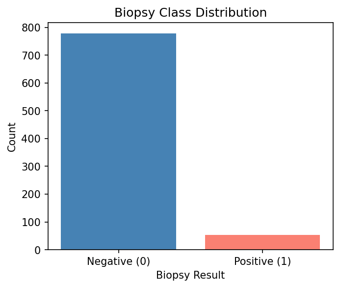
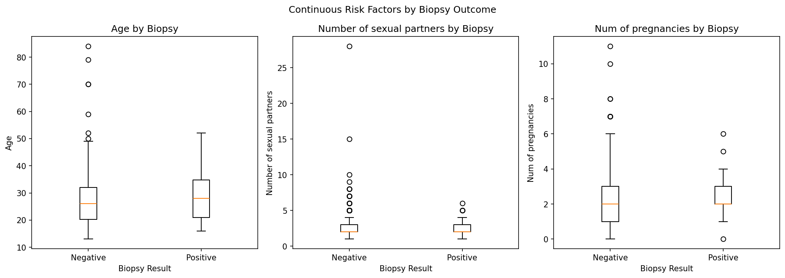
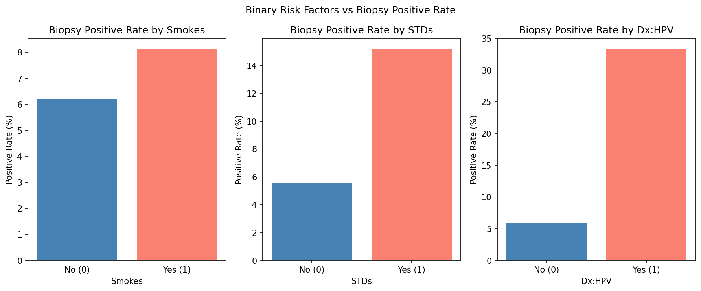
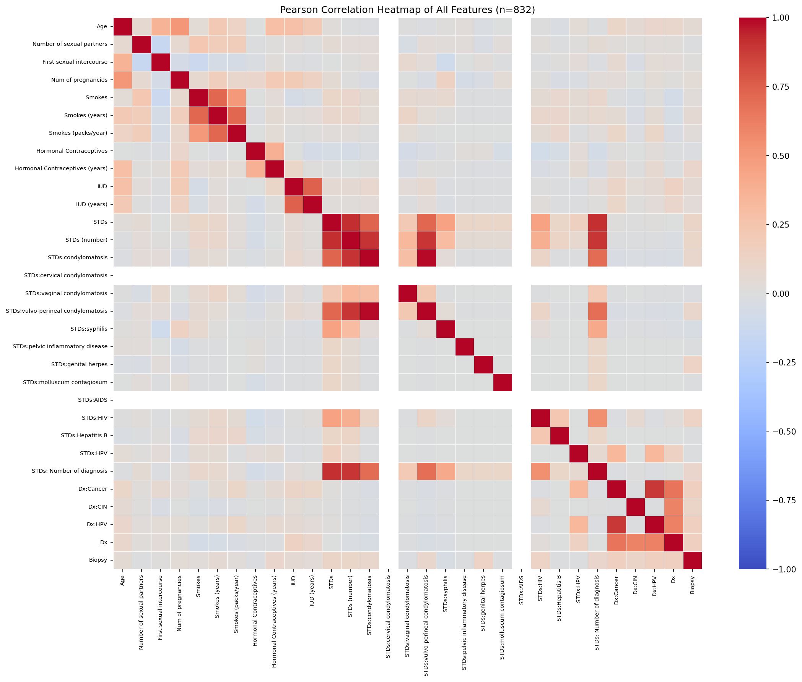
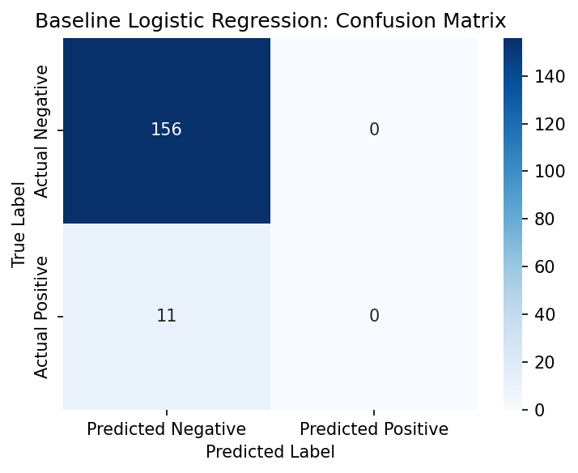
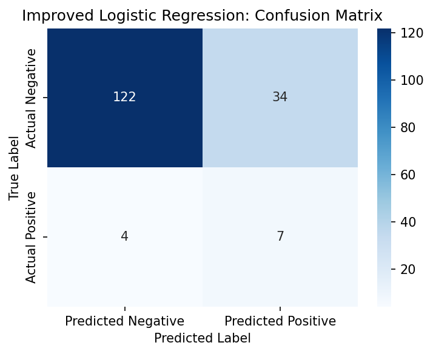
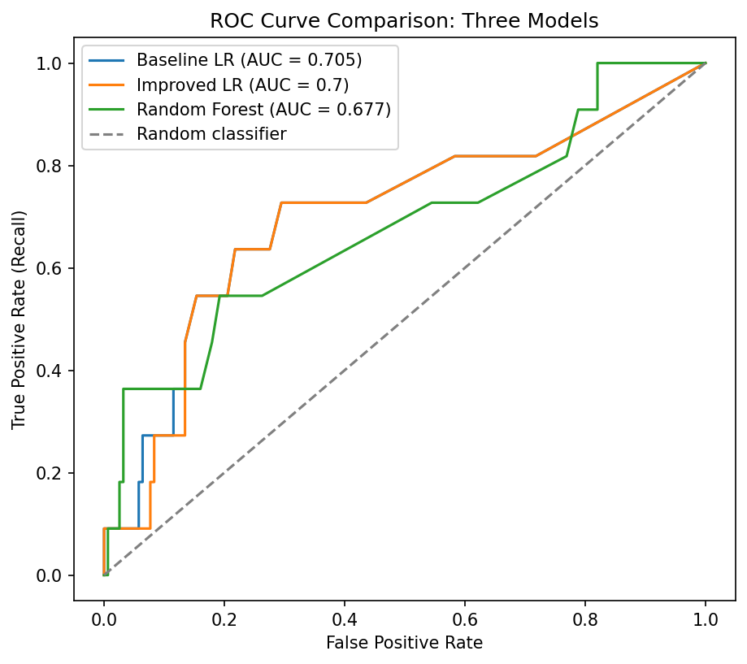

# Cervical Cancer Risk Classification: Proof-of-Concept Model for Dreaded-Disease Benefit Triage

**Student:** Liam Johnie | **Student Number:** ST10536072 | **Module:** PDAN8411 POE Part 2

---

## 1. Summary Overview

This proof-of-concept study developed a binary classification model to assist a South African medical aid scheme in triaging dreaded-disease benefit claims for cervical cancer. The Cervical Cancer (Risk Factors) dataset (Fernandes, Cardoso and Fernandes, 2017), comprising 858 patient records and 36 columns from a Venezuelan hospital, was used as training and evaluation data. After removing 26 duplicate rows, dropping two near-empty columns, and applying median imputation, the working dataset contained 832 rows and 31 columns. Feature selection via backward elimination on a statsmodels Logistic Regression retained four statistically significant predictors. Three models were evaluated: a baseline Logistic Regression, an improved Logistic Regression with balanced class weighting and cross-validated regularisation tuning, and a Random Forest benchmark. The improved Logistic Regression achieved a positive-class recall of 0.6364 on the held-out test set, correctly identifying 7 of 11 cancer cases that the baseline model missed entirely.

---

## 2. Introduction

South African medical aid schemes are required under Prescribed Minimum Benefits to provide cover for dreaded diseases, including cervical cancer. The process of reviewing benefit claims is resource-intensive, and delays in identifying eligible patients can have serious clinical consequences. A classification model that flags high-risk claims for prioritised clinical review offers a mechanism to reduce processing time and reduce the risk of missed diagnoses.

This study trains and evaluates a binary classifier using patient demographic, behavioural, and medical history data as predictors, with a confirmed Biopsy result as the ground truth target. Logistic Regression was selected as the primary algorithm because it produces directly interpretable log-odds coefficients, allowing a benefits assessor to trace and explain which patient characteristics drove a specific flagging decision, which is a regulatory requirement for automated benefit decisions. A Random Forest classifier was evaluated as a benchmark to determine whether the added complexity of an ensemble model offered any measurable advantage over the linear approach (scikit-learn developers, 2024).

The analysis addresses three intersecting technical challenges: severe class imbalance (6.5% positive cases), limited sample size for the minority class (54 positive cases), and the presence of missing values and quasi-complete separation that required careful preprocessing. The techniques applied (stratified splitting, balanced class weighting, backward elimination feature selection) are standard practice for clinical classification tasks with rare events.

---

## 3. Dataset Overview

The dataset is the Cervical Cancer (Risk Factors) dataset, originally collected at Hospital Universitario de Caracas, Venezuela, and described in Fernandes, Cardoso and Fernandes (2017). It is publicly available through the UCI Machine Learning Repository. The original file contains 858 patient records and 36 columns. Variables cover four categories: demographic information (age, number of sexual partners, number of pregnancies), behavioural habits (smoking duration and intensity, hormonal contraceptive use, IUD use), prior medical history (15 STD-related indicator and count columns), and four binary diagnostic test results (Hinselmann, Schiller, Citology, Biopsy). Note that the original file uses the non-standard spelling "Citology" rather than "Cytology," a known artefact of the source data.

The Biopsy column was selected as the sole target variable. Biopsy is the definitive histological test for cervical cancer and provides the most reliable ground truth. The other three diagnostic columns were dropped before any modelling to prevent target leakage: each records the result of a different test from the same clinical episode and would give the model access to peer diagnosis information rather than upstream patient risk factors.

Two significant data-quality issues were identified and addressed. First, missing values were encoded as the string "?" rather than a null; these were converted to NaN on load and handled by median imputation after dropping two columns (STDs: Time since first diagnosis and STDs: Time since last diagnosis) that were each 91.7% missing. Second, the target is severely imbalanced: after cleaning, 54 of 832 records are Biopsy-positive (6.5%), giving a 14:1 negative-to-positive ratio. This imbalance has direct consequences for model training and evaluation, described in subsequent sections.

---

## 4. Exploratory Data Analysis

### 4.1 Target Class Distribution

The bar chart shows that 778 of 832 records (93.5%) are Biopsy-negative and 54 records (6.5%) are Biopsy-positive in the cleaned dataset. This 14:1 class ratio is the most consequential single characteristic of the dataset for the modelling task, because it means a trivial classifier that predicts the negative class for every patient achieves 93.5% accuracy while detecting zero cancer cases. Accuracy is therefore structurally uninformative as a model selection criterion on this data, and recall on the positive class is adopted as the primary evaluation metric because it directly measures the rate at which cancer cases are correctly identified. The imbalance also makes the selection of an appropriate training strategy critical: the default Logistic Regression treats every error equally and, as Section 6 shows, learns to predict the majority class exclusively. The `class_weight='balanced'` parameter in the improved model counteracts this by increasing the per-sample loss weight for the minority class proportional to the class ratio (scikit-learn developers, 2024).

### 4.2 Risk Factors versus Biopsy Outcome

The grouped boxplots compare the distributions of Age, Number of Sexual Partners, and Number of Pregnancies between Biopsy-negative and Biopsy-positive patients. Biopsy-positive patients have a higher median age than negative patients, with the positive-group box shifted upward and showing greater spread at the upper quartile, consistent with the known epidemiology of cervical cancer as a condition that often takes years to develop following initial HPV infection. Number of Sexual Partners shows a modest upward shift in the positive group but with wide overlap between groups, suggesting limited standalone discriminatory power. Number of Pregnancies shows a similar pattern: a small positive-group elevation with substantial overlap. The wide interquartile-range overlap in all three continuous features explains why none of them survived the backward elimination feature selection procedure: their Wald p-values in the initial Logit model were above 0.05, indicating insufficient statistical evidence of association after accounting for the other predictors.

The bar charts show the proportion of Biopsy-positive cases among patients who reported or did not report each of three binary risk factors: smoking, any STD diagnosis, and prior HPV diagnosis (Dx:HPV). Patients with a prior STD diagnosis show an elevated Biopsy positive rate compared to those without, and those with a recorded Dx:HPV diagnosis show a further elevated positive rate, reflecting the well-established link between persistent HPV infection and cervical cancer development (Fernandes, Cardoso and Fernandes, 2017). Smoking shows a smaller difference between the yes and no groups, indicating it is a weaker univariate discriminator in this sample. These visual associations foreshadowed the feature selection findings: Dx-related variables were the most informative predictors in the backward elimination procedure, while smoking was eliminated early.

### 4.3 Correlation Heatmap

The full Pearson correlation heatmap displays pairwise linear correlations among all 31 variables in the cleaned dataset, with warm colours indicating positive correlation and cool colours indicating negative correlation. The Dx prior-diagnosis columns (Dx, Dx:Cancer, Dx:HPV, Dx:CIN) show the strongest positive correlations with Biopsy, visible as a band of warm colour in the Biopsy row and column, confirming that a prior cancer-related diagnosis is the most informative predictor available in this feature set. The STD indicator columns form a cluster of strong inter-correlations in the lower-left region of the heatmap, because patients who reported one type of STD were frequently positive for others, creating a near-redundant group of binary variables. This inter-correlation among STD columns raises multicollinearity concerns for logistic regression: fitting all STD indicators simultaneously would produce unstable coefficient estimates. The variance inflation factor analysis following feature selection confirmed that the final four-feature model has VIF values at or below 1.02, indicating no residual collinearity among the retained predictors.

---

## 5. Data Splitting

The 832-row dataset was split into training and test subsets using an 80/20 ratio, giving 665 training rows and 167 test rows. Stratification on the target variable was applied to ensure both subsets preserved the 6.5% positive-class share: without stratification, a random split of a 54-patient minority class can produce very unequal positive-case counts by chance, particularly when the class is as small as the one in this dataset (scikit-learn developers, 2024). The stratified split produced 43 positive cases in the training set and 11 in the test set. `random_state=42` was fixed throughout to ensure reproducibility. The test set was held out completely and was not used during feature selection, model fitting, or hyperparameter tuning. Feature scaling using `StandardScaler` was applied after splitting, with the scaler fitted on training data only and applied to both sets, to prevent test-set statistics from influencing the transformation.

---

## 6. Model Creation and Fitting

### Feature Selection

Feature selection followed a three-stage process. First, the `STDs (number)` column was dropped because it is the arithmetic sum of the individual STD indicator columns, creating a perfect linear dependency that guarantees a singular covariance matrix. Second, binary columns with fewer than 15 observations in the minority category were dropped; with only 54 positive Biopsy cases, a binary predictor with fewer than 15 minority-class observations cannot support a stable logistic regression coefficient. Third, a statsmodels Logistic Regression (Logit) was fitted on all remaining features and backward elimination by Wald p-value (threshold 0.05) was applied iteratively (statsmodels developers, 2024). The initial fit did not converge due to quasi-complete separation in the Dx:Cancer and Dx:HPV columns; these were removed early in the elimination process. The procedure converged after seven iterations on four retained features: `Dx` (any prior diagnosis, p < 0.001, odds ratio 7.8), `STDs:HIV` (p = 0.003, odds ratio 5.5), `STDs:vulvo-perineal condylomatosis` (p = 0.017, odds ratio 3.0), and `Hormonal Contraceptives (years)` (p = 0.003, odds ratio 1.09 per additional year). All four retained features had VIF values at or below 1.02, confirming no multicollinearity (statsmodels developers, 2024).

### Baseline Logistic Regression

The baseline model used scikit-learn's `LogisticRegression` with default settings: L2 regularisation, `C=1.0`, and no class weighting (scikit-learn developers, 2024). As shown in the confusion matrix below, the model predicted the negative class for every single test patient.

The baseline confusion matrix shows 156 true negatives, 0 true positives, 11 false negatives, and 0 false positives. Every one of the 11 Biopsy-positive patients in the test set was misclassified as negative, giving a positive-class recall of 0.0000. This outcome is the expected result of training a default classifier on a 14:1 imbalanced target: the loss function treats a false negative as no more costly than a false positive, so the optimiser learns that always predicting the majority class minimises the total error count. The 93.4% accuracy figure is entirely attributable to correctly classifying the 156 negative cases. Despite this hard-prediction failure, the ROC AUC of 0.7054 indicates that the model's internal probability scores are reasonably well-ranked, confirming that the four features carry genuine discriminative information.

### Improved Logistic Regression

The improved model used `class_weight='balanced'`, which reweights the per-sample loss so that each false negative on the minority class is penalised proportionally more than a false positive (scikit-learn developers, 2024). The regularisation strength `C` was selected via `GridSearchCV` over the grid {0.01, 0.1, 1.0, 10.0, 100.0} with five-fold stratified cross-validation scored on positive-class recall. The selected value was `C = 0.1`, with a cross-validated recall of 0.5139. The confusion matrix for the test set is shown below.

The improved model's confusion matrix shows 122 true negatives, 34 false positives, 4 false negatives, and 7 true positives. Positive-class recall rose from 0.0000 (baseline) to 0.6364, meaning the model now correctly identifies 7 of the 11 cancer cases that the baseline missed entirely. The cost of this improvement is 34 false positives: patients predicted as high-risk who do not have cancer. In a triage context, false positives result in unnecessary clinical review appointments rather than erroneous benefit payments, which is a manageable cost relative to the alternative of missing a cancer diagnosis. Four cases remain as false negatives; this is a known limitation of the proof-of-concept, arising from the small positive-class sample and the limited number of available predictors.

### Random Forest Benchmark

A `RandomForestClassifier` with `class_weight='balanced'` and 100 estimators was fitted as a benchmark (scikit-learn developers, 2024). It achieved a positive-class recall of 0.3636 (4 of 11 cancer cases detected), a ROC AUC of 0.6769, and an accuracy of 0.8623. On every metric relevant to this task, the Random Forest underperformed the improved Logistic Regression.

### ROC Curve Comparison

The ROC curves plot the true positive rate (recall) against the false positive rate across every possible classification threshold for each of the three models, alongside the random-classifier diagonal for reference. All three curves lie above the diagonal, confirming that all models have discriminative ability beyond chance across all thresholds. The AUC values are 0.705 (baseline LR), 0.700 (improved LR), and 0.677 (Random Forest), a spread of only 0.028 between best and worst. This narrow spread is an important finding: the three models extract essentially the same amount of discriminative information from the four features, and the large difference in hard-prediction recall between the baseline (0.0000) and the improved LR (0.6364) is not because the improved model learned anything new, but because `class_weight='balanced'` shifted the decision boundary so that the existing probability-score ranking was converted into positive predictions rather than suppressed by the majority-class prior. The Random Forest curve sits below both logistic regression curves across most of the false-positive-rate range, consistent with its lower AUC, indicating that for this low-dimensional feature space the linear model is the stronger discriminator.

---

## 7. Model Evaluation

The table below summarises performance on the 167-observation test set (156 negative, 11 positive) for all three models.

| Model | Accuracy | Precision | Recall | F1 | ROC AUC |
|---|---|---|---|---|---|
| Baseline Logistic Regression | 0.9341 | 0.0000 | 0.0000 | 0.0000 | 0.7054 |
| Improved Logistic Regression | 0.7725 | 0.1707 | **0.6364** | 0.2692 | 0.7002 |
| Random Forest | 0.8623 | 0.2000 | 0.3636 | 0.2581 | 0.6769 |

**Priority metric: positive-class recall.** A false negative in this context means a patient with cervical cancer is denied a dreaded-disease benefit they are entitled to under their medical aid policy, while their condition goes undetected in the triage system. Recall directly measures the false-negative rate and is therefore the first selection criterion. On this metric the improved Logistic Regression (0.6364) is the clear winner, outperforming the Random Forest (0.3636) by 0.2728 points and the baseline (0.0000) by 0.6364 points.

**ROC AUC** provides a threshold-independent measure of discriminative quality. The improved LR leads with 0.7002, ahead of the Random Forest (0.6769). Accuracy is reported for completeness but is not used to select the model because it is structurally biased toward the 93.5% majority class.

**Final model selection: Improved Logistic Regression (C = 0.1, class_weight = 'balanced').** The improved LR is selected on three grounds: it achieves the highest positive-class recall (0.6364); it achieves the highest ROC AUC (0.7002); and its coefficients have direct log-odds interpretation, allowing a benefits assessor to explain why a specific claim was flagged. The Random Forest offers neither better performance nor interpretability and is not recommended for this use case.

---

## 8. Recommendations

The following recommendations are addressed to the South African medical aid scheme and are grounded in specific findings from this analysis.

**1. Deploy the improved Logistic Regression as a triage flag, not an automated approval system.**
The model achieved a positive-class recall of 0.6364 on the test set, meaning 36% of cancer cases would still be missed (4 of 11 in this evaluation). A model with this performance level should be used to flag claims for prioritised clinical review by a medical advisor, not to make autonomous benefit decisions. This limits regulatory and legal exposure while still delivering a reduction in processing time for the highest-risk claims.

**2. Lower the decision threshold below the default 0.5.**
The current evaluation uses the default probability threshold of 0.5. In a medical triage context, the cost of a false negative (missed cancer diagnosis, delayed treatment, potential litigation) substantially exceeds the cost of a false positive (an additional clinical review appointment). Reducing the threshold to 0.3 or 0.35 would increase recall further at the cost of additional false positives. The medical aid scheme should quantify the operational cost per additional review appointment and compare it to the clinical and financial cost of a missed diagnosis to determine the optimal threshold for production use.

**3. Prioritise clinical review for patients with prior diagnosis records and HIV-positive status.**
The two strongest predictors in the final model are the prior diagnosis flag `Dx` (odds ratio 7.8, p < 0.001) and an HIV diagnosis (`STDs:HIV`, odds ratio 5.5, p = 0.003). Claims from patients who carry both risk factors simultaneously warrant immediate expedited review, independent of the model's predicted probability. These findings are consistent with the well-documented co-morbidity between HIV-related immunosuppression and persistent HPV infection, which is relevant given South Africa's HIV prevalence (WHO, 2024).

**4. Commission a local South African training dataset before production deployment.**
The model was trained on data from Hospital Universitario de Caracas, Venezuela. Demographic, behavioural, and clinical patterns relevant to cervical cancer risk, including HIV prevalence, HPV vaccination rates, contraceptive use patterns, and healthcare access, differ significantly between Venezuela and South Africa. The model's performance on South African patients is unknown. A minimum viable production dataset should include locally collected cervical screening records with confirmed Biopsy outcomes, collected across multiple facilities and geographic regions to avoid single-institution bias.

**5. Validate feature availability at the point of claim submission.**
The strongest predictor (`Dx`) is a prior-diagnosis aggregate derived from clinical records. In a claims-filing workflow, this information may not be consistently available or standardised at the point of triage. Before deployment, the scheme should confirm which of the four model features are reliably captured on claim submission forms and, where necessary, restructure the intake process to collect them.

**6. Establish a model monitoring and retraining schedule.**
Model performance should be evaluated against live claim outcomes at six-month intervals. If the true positive rate falls below 0.50 on incoming data, the model should be retrained on the expanded dataset. Population-level changes that would trigger earlier review include: introduction of an HPV vaccination programme (which would alter the distribution of the HPV-related predictors), changes to clinical recording practices, and shifts in the demographic composition of the claimant pool.

---

## 9. Conclusion

This study demonstrates that a Logistic Regression classifier trained with balanced class weighting and cross-validated regularisation tuning can recover meaningful discriminative performance on a severely imbalanced clinical dataset. The default baseline model, trained with equal class weights, predicted the negative class for every test patient (recall 0.0000). The improved model correctly identified 7 of 11 cancer cases in the test set (recall 0.6364) by reweighting the training loss to penalise false negatives proportionally, without requiring any change to the feature set or model architecture.

The four-feature model (Dx, STDs:HIV, STDs:vulvo-perineal condylomatosis, Hormonal Contraceptives (years)) is interpretable: each coefficient corresponds to a clinically grounded risk factor with a directionally coherent odds ratio. No evidence of overfitting was detected: the cross-validated recall of 0.5139 and the test-set recall of 0.6364 are consistent in direction, and the modest difference is attributable to the small positive-class sample rather than systematic overfit.

**Limitations.** The dataset originates from a single Venezuelan hospital and is not representative of South African patients. The positive class contains only 54 records, making performance estimates on the 11-patient test set subject to substantial sampling uncertainty. The duplicate-row removal in preprocessing (26 rows, 3% of records) could not be validated against patient identifiers, which were not present in the source data. Finally, the `Dx` prior-diagnosis column may not be available at the time of claim submission, which would limit the model's applicability in a live triage workflow. Retraining on South African clinical data with validated feature availability is a prerequisite for any production deployment.

---

## References

Fernandes, K., Cardoso, J.S. and Fernandes, J. (2017) 'Transfer learning with partial observability applied to cervical cancer screening', in *Proceedings of the 8th Iberian Conference on Pattern Recognition and Image Analysis (IbPRIA 2017)*, Faro, Portugal, June. Springer. Available at: https://archive.ics.uci.edu/dataset/383/cervical+cancer+risk+factors [Accessed 21 May 2026].

The Matplotlib development team (2024) *Matplotlib documentation*. Available at: https://matplotlib.org/stable/ [Accessed 21 May 2026].

NumPy developers (2024) *NumPy documentation*. Available at: https://numpy.org/doc/stable/ [Accessed 21 May 2026].

pandas development team (2024) *pandas documentation*. Available at: https://pandas.pydata.org/docs/ [Accessed 21 May 2026].

scikit-learn developers (2024) *scikit-learn: machine learning in Python*. Available at: https://scikit-learn.org/stable/ [Accessed 21 May 2026].

statsmodels developers (2024) *statsmodels documentation*. Available at: https://www.statsmodels.org/stable/index.html [Accessed 21 May 2026].

Waskom, M. (2021) 'seaborn: statistical data visualization', *Journal of Open Source Software*, 6(60), p. 3021. Available at: https://doi.org/10.21105/joss.03021 [Accessed 21 May 2026].

WHO (2024) *Cervical cancer*. Available at: https://www.who.int/news-room/fact-sheets/detail/cervical-cancer [Accessed 21 May 2026].
